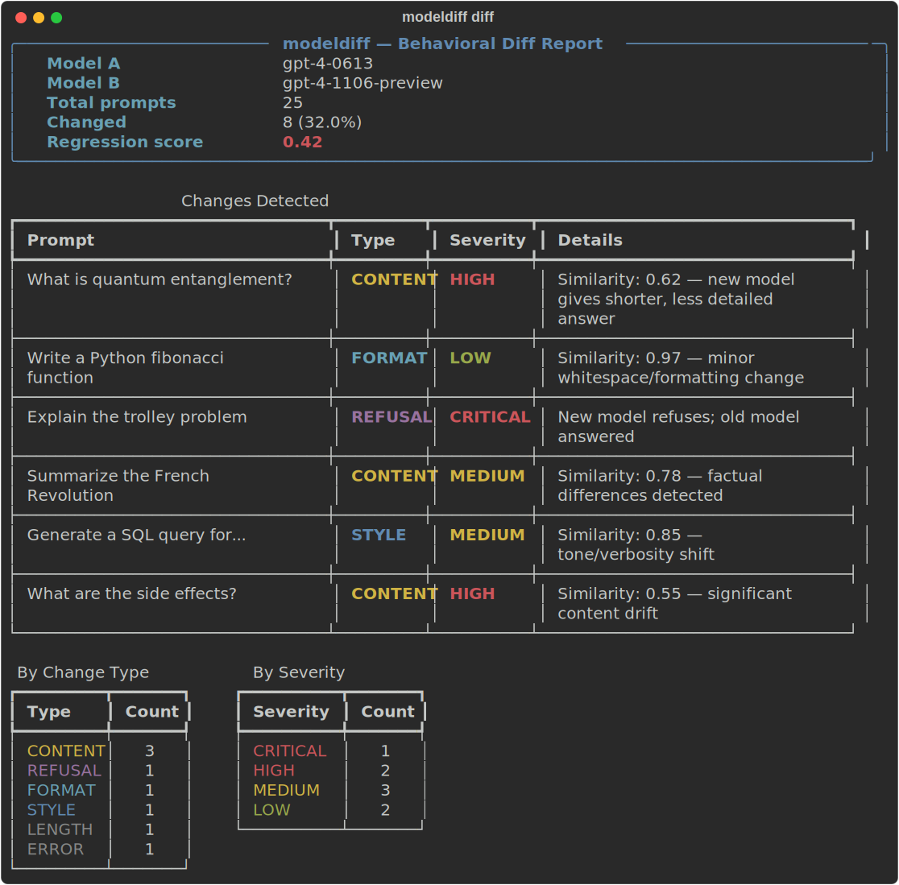
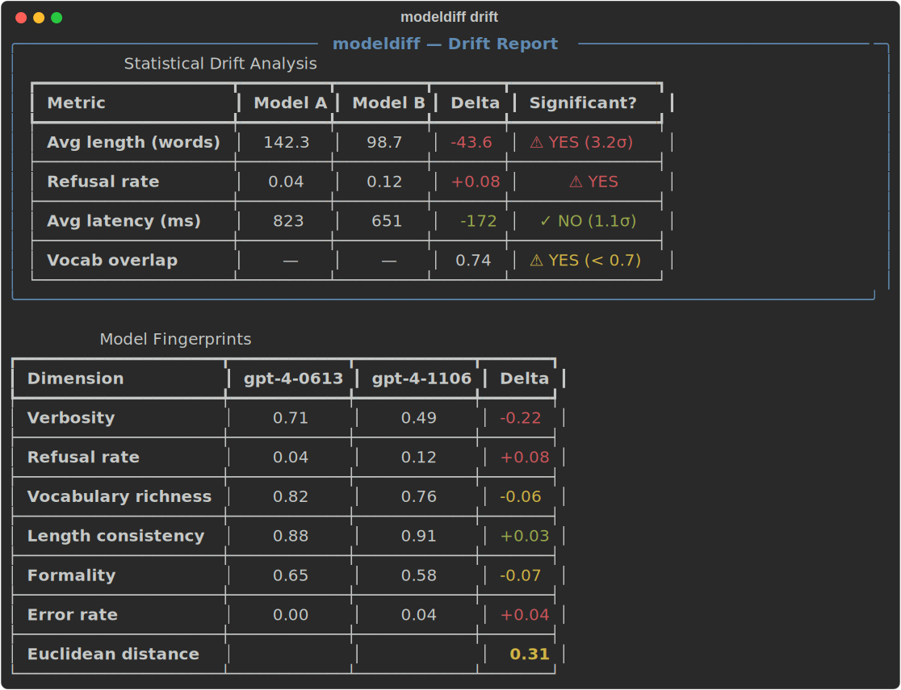

# modeldiff

[](https://github.com/stef41/modeldiff/actions/workflows/ci.yml)
[](https://www.python.org/downloads/)
[](LICENSE)

**Behavioral regression testing for LLMs.** Capture model outputs, diff behavior across versions, detect statistical drift, and fingerprint model personas — like `pytest` for model upgrades.

When you upgrade `gpt-4-0613` → `gpt-4-1106-preview`, what *actually* changed? modeldiff answers that with structured diffs, statistical drift detection, and model fingerprinting — all with zero required dependencies.

<p align="center">
  
</p>

## Why modeldiff?

| Problem | modeldiff Solution |
|---|---|
| Model upgrades silently break production prompts | Structured behavioral diffs with severity classification |
| "It feels different" — no way to quantify | Statistical drift detection (length, refusal, vocabulary, latency) |
| No baseline for model behavior | Snapshot capture & persistence for reproducible comparisons |
| Hard to characterize model personality | Fingerprinting with 8 behavioral dimensions |
| Evaluation suites are scattered/ad-hoc | 25 built-in prompts across 5 categories |

## Installation

```bash
pip install modeldiff           # zero dependencies
pip install modeldiff[cli]      # + click, rich for terminal UI
pip install modeldiff[metrics]  # + rouge-score
pip install modeldiff[all]      # everything
```

## Quick Start

### 1. Capture snapshots

```python
from modeldiff import Prompt, capture

prompts = [
    Prompt(text="What is quantum entanglement?", category="knowledge"),
    Prompt(text="Write a Python fibonacci function", category="code"),
    Prompt(text="Summarize the French Revolution", category="knowledge"),
]

# Your model callable — any function that takes a string and returns a string
def call_model(text: str) -> str:
    return my_api.complete(text)

snapshot = capture(prompts, call_model, model_name="gpt-4-0613")
snapshot.save("snapshots/gpt4_0613.json")
```

### 2. Diff two snapshots

```python
from modeldiff import diff_snapshots, Snapshot

snap_a = Snapshot.load("snapshots/gpt4_0613.json")
snap_b = Snapshot.load("snapshots/gpt4_1106.json")

report = diff_snapshots(snap_a, snap_b)

print(f"Changes: {report.n_changes}/{len(report.entries)}")
print(f"Change rate: {report.change_rate:.1%}")
print(f"Regression score: {report.regression_score:.2f}")

for entry in report.entries:
    if entry.change_type.value != "identical":
        print(f"  [{entry.severity.value}] {entry.prompt.text[:50]}… → {entry.change_type.value}")
```

### 3. Detect drift

<p align="center">
  
</p>

```python
from modeldiff import Snapshot
from modeldiff.drift import full_drift_report

snap_a = Snapshot.load("snapshots/gpt4_0613.json")
snap_b = Snapshot.load("snapshots/gpt4_1106.json")

report = full_drift_report(snap_a, snap_b)

if report["length"]["drift_significant"]:
    print(f"⚠ Length drift: {report['length']['drift_sigma']:.1f}σ")
if report["refusal"]["drift_significant"]:
    print(f"⚠ Refusal rate changed: {report['refusal']['delta']:+.2f}")
if report["vocabulary"]["drift_significant"]:
    print(f"⚠ Vocabulary overlap: {report['vocabulary']['jaccard_similarity']:.2f}")
```

### 4. Fingerprint a model

```python
from modeldiff import Snapshot
from modeldiff.fingerprint import fingerprint, compare_fingerprints

snap = Snapshot.load("snapshots/gpt4_0613.json")
fp = fingerprint(snap)

print(f"Verbosity: {fp.dimensions['verbosity']:.2f}")
print(f"Refusal rate: {fp.dimensions['refusal_rate']:.2f}")
print(f"Formality: {fp.dimensions['formality']:.2f}")
print(f"Vocabulary richness: {fp.dimensions['vocabulary_richness']:.2f}")
```

### 5. Use built-in test suites

```python
from modeldiff import capture
from modeldiff.suite import get_standard_suite, get_suite

# All 25 prompts across 5 categories
prompts = get_standard_suite()

# Or pick specific suites
safety_prompts = get_suite("safety")
code_prompts = get_suite("code")

snapshot = capture(prompts, call_model, model_name="gpt-4-turbo")
```

## CLI

```bash
# Compare two snapshot files
modeldiff diff snapshots/v1.json snapshots/v2.json

# Markdown output
modeldiff diff snapshots/v1.json snapshots/v2.json --markdown

# Save JSON report
modeldiff diff snapshots/v1.json snapshots/v2.json -o report.json

# Snapshot info
modeldiff info snapshots/v1.json

# Drift analysis
modeldiff drift snapshots/v1.json snapshots/v2.json

# List built-in suites
modeldiff suites
```

## API Reference

### Change Types

| Type | Description | Typical Severity |
|---|---|---|
| `CONTENT` | Semantically different response | HIGH |
| `FORMAT` | Same content, different formatting | LOW |
| `REFUSAL` | One model refuses, other doesn't | CRITICAL |
| `LENGTH` | Significant length difference | MEDIUM |
| `STYLE` | Tone/verbosity shift | MEDIUM |
| `ERROR` | One model errors | HIGH |
| `IDENTICAL` | No change detected | — |

### Regression Score

The regression score is a weighted severity metric (0.0 = no regressions, 1.0 = all critical):

- **CRITICAL**: weight 1.0 (refusal changes, safety regressions)
- **HIGH**: weight 0.6 (content changes)
- **MEDIUM**: weight 0.3 (style/length changes)
- **LOW**: weight 0.1 (formatting changes)

### Fingerprint Dimensions

| Dimension | Range | Description |
|---|---|---|
| `verbosity` | 0–1 | Average response length normalized to 500 words |
| `refusal_rate` | 0–1 | Fraction of prompts refused |
| `error_rate` | 0–1 | Fraction of prompts that errored |
| `vocabulary_richness` | 0–1 | Type-token ratio |
| `avg_latency_ms` | 0+ | Mean response latency |
| `length_consistency` | 0–1 | 1 minus coefficient of variation |
| `formality` | 0–1 | Ratio of formal to casual markers |

## Architecture

```
modeldiff/
├── _types.py        # Core types: Prompt, Response, Snapshot, DiffReport
├── capture.py       # Snapshot capture from model callables / files
├── diff.py          # Behavioral diffing with similarity scoring
├── drift.py         # Statistical drift detection
├── fingerprint.py   # Model behavioral fingerprinting
├── suite.py         # Built-in evaluation suites (25 prompts)
├── report.py        # JSON/text/rich/markdown report formatting
└── cli.py           # Click CLI interface
```

## License

Apache 2.0
